<!-- ⭐ Animated space banner: ดาวตก + วงโคจรดวงดาว (ตัวไฟล์ SVG อยู่ที่ ./assets/space-banner.svg) -->

  

### 👨‍💻 About Me

- 💻 **Stack**: Full Stack Developer

- 🚀 **Currently Learning**: Cybersecurity

- 🎯 **Goal**: Growing into a Senior Developer to build things that bring value to the world

### 🛠️ Tech Stack
| Frontend | Backend | Database | Familiar With |
|----------|---------|----------|---------------|
|         |    |      |    |

### 📫 Connect with Me
📧 **Email**: [mak0623077175@gmail.com](mailto:mak0623077175@gmail.com)

<picture>
  <source media="(prefers-color-scheme: dark)" srcset="https://raw.githubusercontent.com/Bunyawat-Sing/Bunyawat-Sing/output/github-snake-dark.svg" />
  <source media="(prefers-color-scheme: light)" srcset="https://raw.githubusercontent.com/Bunyawat-Sing/Bunyawat-Sing/output/github-snake.svg" />
  
</picture>
